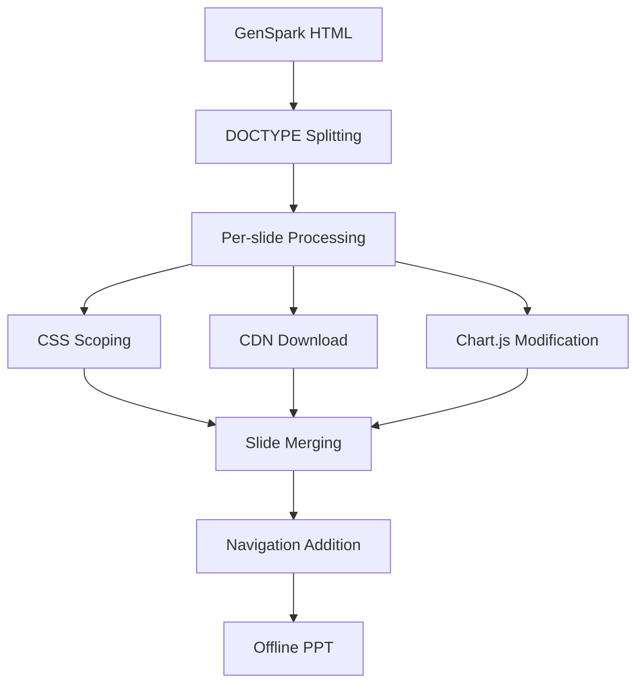

# 🎯 GenSpark AI Slide Converter (GenSpark HTML Slide Converter)


A high-performance Python tool that converts multi-slide HTML generated by [**GenSpark AI**](https://www.genspark.ai/) into **completely offline** presentations.

## 🌟 What is GenSpark AI?

[**GenSpark AI**](https://www.genspark.ai/) is an AI-powered automatic slide generation service that creates professional presentation slides based on user-provided topics or text. This tool converts HTML slides generated by GenSpark into complete offline presentations.

## ✨ Key Features

### 🎨 UI/UX Enhancements
- 📦 **Centered Slide Container**: Screen-centered layout + complete preservation of original content styles
- 🎭 **Complete CSS Isolation per Slide**: CSS scoping prevents style conflicts entirely
- 📜 **Infinite Scroll Support**: Free vertical scrolling for long content
- 🌓 **Auto Dark Theme**: GitHub Dark theme code highlighting
- 🔍 **Fullscreen Mode**: Immersive presentation with F11 or button

### 📊 Technical Features
- 🚀 **Perfect Chart.js Compatibility**: Multi-chart conflict resolution and independent rendering
- 🔤 **Complete Font Awesome Embedding**: All icons work offline
- 🌐 **CDN Resource Localization**: Download & embed all external resources
- 💾 **Intelligent Caching**: Prevent duplicate downloads for faster conversion
- 📱 **Responsive Design**: Optimized viewing on all devices

### 🎯 Conversion Process
- 📄 **DOCTYPE-based Splitting**: Auto-detect and split GenSpark multi-slides
- 🔗 **Slide Merging**: Perfect combination into unified presentation
- ⚡ **Parallel Processing**: Multi-threaded resource downloading
- 🛡️ **Error Recovery**: Auto-retry on network failures

## 🚀 Quick Start

### 📋 Requirements
- **Python 3.6+** (3.8+ recommended)
- **Internet Connection** (for initial CDN resource download)
- **Web Browser** (Chrome, Firefox, Safari, Edge, etc.)

### 📦 Installation

1. **Clone Repository**
```bash
git clone https://github.com/your-repo/genspark-converter.git
cd genspark-converter
```

2. **Install Dependencies**
```bash
pip install -r requirements.txt
```

Or manual installation:
```bash
pip install beautifulsoup4>=4.12.0 requests>=2.31.0 lxml>=4.9.0
```

## 💻 Usage

### 1️⃣ Basic Usage
1. Save HTML slide files generated by [GenSpark AI](https://www.genspark.ai/) in the `source/` folder
2. Run conversion command:

```bash
# Basic conversion
python converter.py merge13.html

# Extension optional
python converter.py merge13

# Windows batch file (for testing)
test.bat
```

3. Check converted file: `output/merge13_ppt.html`
4. Run presentation in web browser

### 2️⃣ Directory Structure
```
📁 gen_merge/
├── 📄 converter.py          # Main conversion script (v4.7)
├── 📄 plan.py              # Modularization plan
├── 📄 requirements.txt     # Dependencies list
├── 📄 test.bat             # Windows test batch
├── 📁 source/              # Input: GenSpark HTML files
├── 📁 output/              # Output: Converted presentations
├── 📁 cache/               # Cache: Downloaded resources
├── 📁 build/               # Build: Distribution executables
└── 📁 assets/              # Assets: Default themes & icons
```

### 3️⃣ File Conversion Flow
```
Input: source/merge13.html (GenSpark multi-slides)
  ↓ DOCTYPE pattern splitting
  ↓ Per-slide CSS isolation  
  ↓ CDN resource download & embedding
  ↓ Chart.js conflict resolution
  ↓ Navigation system construction
Output: output/merge13_ppt.html (Offline presentation)
```

## ⌨️ Control Guide

### 🎹 Keyboard Shortcuts
| Key Combination | Function | Description |
|-----------------|----------|-------------|
| `←` `→` | Slide Navigation | Move to previous/next slide |
| `↑` `↓` | In-slide Scroll | Scroll up/down within current slide |
| `Page Up/Down` | Page Scroll | Scroll one screen at a time |
| `Home` `End` | Scroll to Edge | Move to top/bottom of slide |
| `Ctrl+Home/End` | Slide Edge | Move to first/last slide |
| `F11` | Fullscreen Toggle | Turn fullscreen mode on/off |
| `Space` | Page Down | Scroll down with spacebar |

### 🖱️ Navigation Buttons (Bottom Right)
| Button | Icon | Function |
|--------|------|----------|
| **Home** | 🏠 | Move to first slide |
| **Previous** | ◀️ | Move to previous slide |
| **Counter** | `1/5` | Display current slide number |
| **Next** | ▶️ | Move to next slide |
| **End** | ⏭️ | Move to last slide |
| **Fullscreen** | 🔲 | Toggle fullscreen mode |

### 📱 Responsive Support
- **Desktop**: Full resolution (max 1280px width)
- **Tablet**: Auto-scaling and touch gestures
- **Mobile**: Support for both portrait/landscape modes

## 🎉 v4.7 Major Updates

### ✅ New Features
- **🎯 Centered Slide Container**: Screen-centered layout + complete original style preservation
- **🔪 Smart DOCTYPE Splitting**: Auto-detect and accurate splitting of GenSpark multi-slides
- **🛡️ Complete CSS Isolation**: Independent CSS scoping per slide to block style conflicts
- **🌙 GitHub Dark Theme**: Auto-detect code-snippet classes and force dark theme
- **📜 Unlimited Scrolling**: Free vertical scrolling support for long content
- **🎮 Enhanced Navigation**: 6 buttons (home/prev/counter/next/end/fullscreen)
- **📊 Complete Chart.js Compatibility**: Independent rendering per canvas, completely resolving multi-chart conflicts

### 🐛 Major Bug Fixes
- ✅ Fixed missing `targetPriceDistChart` variable name issue
- ✅ Fixed Font Awesome font embedding path errors
- ✅ Completely blocked Chart.js multi-chart interference
- ✅ Safe handling of Canvas `getContext` access errors
- ✅ Isolated `const` variable conflicts with IIFE scope
- ✅ 100% preservation of GenSpark original styles
- ✅ Prevented chart memory leaks during slide transitions

### 🚀 Performance Improvements
- **⚡ Parallel Downloads**: Multi-threaded CDN resource processing
- **💾 Intelligent Caching**: Complete elimination of duplicate downloads
- **🔄 Progressive Loading**: Delayed chart initialization per slide
- **📦 File Size Optimization**: CSS duplication removal (300MB+ → normal size)

## 🏗️ Project Architecture

### 📁 Directory Structure
```
gen_merge/                          # 🏠 Project root
├── 📄 converter.py                 # 🎯 Main conversion script (1953 lines)
├── 📄 plan.py                      # 📋 Modularization plan (future refactoring)
├── 📄 requirements.txt             # 📦 Python dependencies specification
├── 📄 test.bat                     # 🧪 Windows test batch file
├── 📄 README.md                    # 📖 Project documentation (Korean)
├── 📄 README-en.md                 # 📖 Project documentation (English)
├── 📁 source/                      # 📥 GenSpark HTML input folder
│   └── merge*.html                 # GenSpark AI generated slides
├── 📁 output/                      # 📤 Converted presentation output
│   └── *_ppt.html                  # Completed offline PPT
├── 📁 cache/                       # 💾 CDN resource cache
│   ├── cache_index.json            # Cache metadata
│   └── *.woff2, *.css, *.js        # Downloaded resources
├── 📁 build/                       # 🔨 Build and distribution files
└── 📁 assets/                      # 🎨 Default themes and icons
    ├── default_theme.css
    └── icons/
```

### 🧩 Core Class Structure
```python
# Current monolithic structure (converter.py)
GoogleFontsProcessor     # Google Fonts CSS/font processing
ResourceCache           # CDN resource caching system  
GenSparkConverter       # Main conversion logic (1500+ lines)
├── HTML parsing & splitting
├── CSS scoping & isolation
├── Code snippet formatting
├── Chart.js conflict resolution
├── Slide manager generation
└── Resource embedding

# Future modular structure (see plan.py)
converter/
├── core/               # Conversion orchestrator
├── resources/          # Resource download & caching
├── parsers/            # HTML/CSS/code parsing
├── generators/         # Script/navigation generation
└── utils/              # Common utilities
```

### 🔄 Conversion Workflow


## 🔧 Advanced Settings & Troubleshooting

### ⚙️ Configuration Options
```python
# Key settings in converter.py
CDN_PATTERNS = [...]           # Supported CDN patterns
CACHE_TTL = 86400             # Cache validity period (24 hours)
MAX_WIDTH = "1280px"          # Maximum slide width
CHART_DELAY = 500             # Chart initialization delay (ms)
```

### 🐛 Common Issue Resolution

#### 1. Conversion Failure
```bash
# Issue: HTML file not found
[ERROR] Input file not found: source/merge13.html

# Solution: Check file path
- Verify file exists in source/ folder
- Check filename and extension accuracy
```

#### 2. Network Errors
```bash
# Issue: CDN resource download failure
[ERROR] Download failed: https://cdn.jsdelivr.net/...

# Solutions:
- Check internet connection status
- Verify firewall/proxy settings
- Delete partial cache files in cache/ folder and retry
```

#### 3. Chart Display Errors
```bash
# Issue: Charts not displaying
[WARN] No canvas found in: slide-0

# Solutions:
- Check JavaScript errors in browser developer tools
- Verify Chart.js CDN loading status
- Wait for chart re-initialization after slide transition
```

### 🔍 Debug Mode
```bash
# Check detailed logs
python converter.py merge13.html 2>&1 | findstr "ERROR"

# Check cache status
dir cache\cache_index.json

# Verify conversion results
start output\merge13_ppt.html
```

### 📊 Performance Optimization Tips
1. **Cache Utilization**: Same CDN resources are reused
2. **Internet Speed**: High-speed internet recommended for first conversion
3. **Memory Management**: Increase Python memory allocation for large file conversion
4. **Parallel Processing**: Accelerate resource downloads with multi-threading

## 🤝 Contributing & Development

### 🛠️ Development Environment Setup
```bash
# Install development dependencies
pip install -r requirements.txt

# Run tests
test.bat

# Code quality check (optional)
pip install flake8 black
flake8 converter.py
black converter.py
```

### 📈 Future Development Plans
- 📋 [**Modularization Plan**](plan.py): Current 1953-line monolith → modular architecture
- 🧪 **Test Coverage**: Add unit tests and CI/CD setup
- 🎨 **Theme System**: Support for custom themes
- 🔌 **Plugin Architecture**: Extensible module system
- 📱 **Mobile Optimization**: PWA support and enhanced touch gestures

### 🐞 Bug Reports
When reporting issues, please include:
- Python version and OS information
- Input file size and slide count
- Complete error message
- Minimal reproducible example

## 📄 License

**MIT License** - Free to use, modify, and distribute

```
Copyright (c) 2024 GenSpark Converter Team

Permission is hereby granted, free of charge, to any person obtaining a copy
of this software and associated documentation files (the "Software"), to deal
in the Software without restriction, including without limitation the rights
to use, copy, modify, merge, publish, distribute, sublicense, and/or sell
copies of the Software, subject to the following conditions:

The above copyright notice and this permission notice shall be included in all
copies or substantial portions of the Software.
```

---

## 🌟 Star History

⭐ **If this project helped you, please give it a star!**

**🚀 Transform GenSpark AI's powerful slides into perfect offline presentations!**
